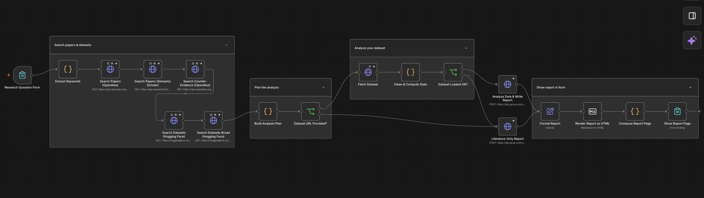

# AI Research Assistant (n8n)

An n8n workflow that turns a research question into a draft research report. You type a question into a form, optionally add a link to a CSV or JSON dataset, and the report appears on the form's completion page in about a minute.

Built entirely on free tiers: n8n, OpenAlex, Semantic Scholar, Hugging Face, and Groq.



## What it does

1. Takes a research question (and an optional direct dataset URL) from an n8n form.
2. Searches for relevant papers, plus a separate search for null or negative results.
3. Searches Hugging Face for candidate datasets.
4. If you supplied a dataset, downloads it and computes summary statistics in code.
5. Asks an LLM to write a structured report from what was retrieved.
6. Shows the report on the form page, with the papers used, papers not used, and datasets found listed underneath.

A full example is in [`sample-report.md`](sample-report.md), generated from the question *"Does Twitter sentiment predict stock returns?"*

## Workflow flow

| Stage | Nodes | What happens |
|---|---|---|
| Input | Research Question Form | n8n Form Trigger with a question field and an optional dataset URL |
| Keywords | Extract Keywords (Code) | Builds paper, dataset, and counter-evidence search queries from the question |
| Paper search | Search Papers (OpenAlex), Search Papers (Semantic Scholar), Search Counter-Evidence (OpenAlex) | Retrieves abstracts. The counter-evidence query targets null or negative findings. |
| Dataset search | Search Datasets (Hugging Face), Search Datasets Broad (Hugging Face) | Two queries, merged and deduplicated |
| Planning | Build Analysis Plan (Code) | Merges and dedupes papers, rebuilds abstracts, filters off-topic results, sets the report prompt |
| Branch | Dataset URL Provided? | Routes to dataset analysis or straight to a literature-only report |
| Dataset analysis | Fetch Dataset, Clean & Compute Stats (Code), Dataset Loaded OK? | Parses CSV/JSON and computes mean, sd, median, and correlations. If loading fails, falls back to literature-only. |
| Report | Analyze Data & Write Report, Literature-Only Report | HTTP request to Groq's OpenAI-compatible endpoint |
| Output | Format Report, Render Report as HTML, Compose Report Page (Code), Show Report Page | Converts Markdown to HTML, sanitizes it, appends sources, and displays it via the Form Ending node |

## Design decisions

- **Statistics are computed in code.** The LLM may only quote the numbers it is given, never calculate or estimate its own.
- **Abstracts only.** The report is based on abstracts and says so. Papers are labeled positive, null, negative, or mixed only as far as the abstract shows.
- **Honest about data fit.** A dataset must have a timestamp, an identifier such as a ticker, and text or a score to be recommended. Otherwise it is labeled unusable for return prediction.
- **Counter-evidence search.** A dedicated query looks for null and negative results, to reduce a one-sided reading list.
- **Used vs. not used.** Retrieved papers the report does not cite are listed separately, so nothing is silently dropped.
- **Sanitized output.** The report page strips scripts, iframes, inline event handlers, and `javascript:` links before display.
- **No LaTeX.** Equations are written in plain text.

## Setup

You will need an n8n account (Cloud or self-hosted) and a free Groq API key.

1. **Create a Groq API key** at [console.groq.com](https://console.groq.com).
2. **Import the workflow.** In n8n, create a new workflow, open the menu (three dots), choose **Import from file**, and select `ai-research-assistant.json`.
3. **Add the LLM credential.** Create an **OpenAI**-type credential in n8n with your Groq key and set the base URL to `https://api.groq.com/openai/v1`. (The OpenAI credential type is reused because Groq's API is OpenAI-compatible; no OpenAI account is needed.) Attach it to the two Groq nodes: *Analyze Data & Write Report* and *Literature-Only Report*.
4. **Set form authentication.** The exported form node uses basic authentication. Either create a Basic Auth credential and attach it, or set the form's authentication to **None** if you want it open.
5. **Check the model.** Both Groq nodes call `openai/gpt-oss-120b`. Change the `model` field in each node's JSON body if you prefer another Groq model.
6. **Set the form's ending.** Confirm the *Show Report Page* node is a Form Ending node using **Show Text**, and that the form trigger's **Respond When** setting lets it display the report.
7. **Publish** the workflow and open the form's production URL.

## Usage

Open the form, enter a research question, and optionally paste a **direct** link to a CSV or JSON file (not a Kaggle or landing page). Wait about a minute for the report.

Questions phrased with specific topic keywords work best. Horizon words like "short-term" tend to narrow the paper search.

## Known limitations

- **Rate limits.** Groq's free tier has a tokens-per-minute cap. Wait about a minute between runs. Semantic Scholar also frequently returns HTTP 429; the workflow continues with OpenAlex results when that happens.
- **Keyword search.** Paper retrieval is keyword-based, so results vary with how the question is worded.
- **Labels are pointers.** LLM labels (positive, null, negative, mixed) can vary between runs and can be wrong. For example, "no effect size reported" may be labeled as a null result. Always check the abstract.
- **Dataset search matches tags, not suitability.** Hugging Face results are ranked by downloads and tag match. Check each dataset card before relying on it.
- **Abstracts only.** No full-text reading, so methodological quality and effect sizes are not assessed.
- **Data access claims.** The prompt guards against outdated claims about Twitter/X API access, but verify any data-access statement yourself.
- **Report length.** The report is kept short to avoid being cut off by the output limit. If it is truncated, the page shows a warning and you can re-run.

This is a tool for producing a reading list and analysis plan to verify, not for producing findings.

## Repository layout

```
.
├── README.md
├── LICENSE
├── ai-research-assistant.json
├── canvas.png
└── sample-report.md
```

## Security

The exported workflow contains no API keys or credential IDs. Credentials stay inside n8n and must be re-attached after import. Do not paste keys into node parameters.

## License

MIT
